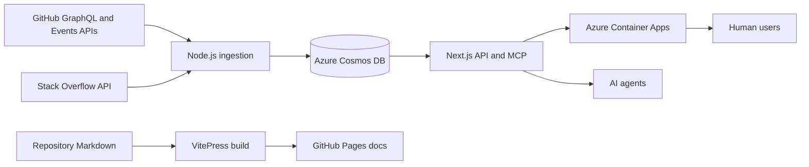

# Architecture and data

## Runtime

The React 19 and Next.js 15 application runs on Azure Container Apps. Azure Cosmos DB stores indexed profiles, vector embeddings, activity, private user-scoped features, and consent records in separate containers. Azure Functions serve high-volume public reads and run scheduled ingestion, snapshot, and lifecycle tasks. Documentation is a static VitePress artifact deployed independently to GitHub Pages.

## Data sources

- GitHub GraphQL supplies profiles, followers, repositories, stars, forks, languages, and contribution counts.
- GitHub Events supplies a best-effort recent activity feed.
- Stack Overflow supplies matched reputation, answers, acceptance rate, and badges.
- Geocoding converts public free-form locations into approximate globe coordinates.

## Freshness and limitations

Source metrics are snapshots, not live counters. GitHub Events may delay or omit events. Stack Overflow matching can be unavailable. Geocoded locations are approximate. The UI marks stale or unknown freshness where possible.

## Privacy boundaries

Public developer documents are kept separate from private contacts, watchlists, saved searches, notification preferences, agent credentials, and introduction decisions. Public APIs project allowlisted fields rather than returning complete database records.